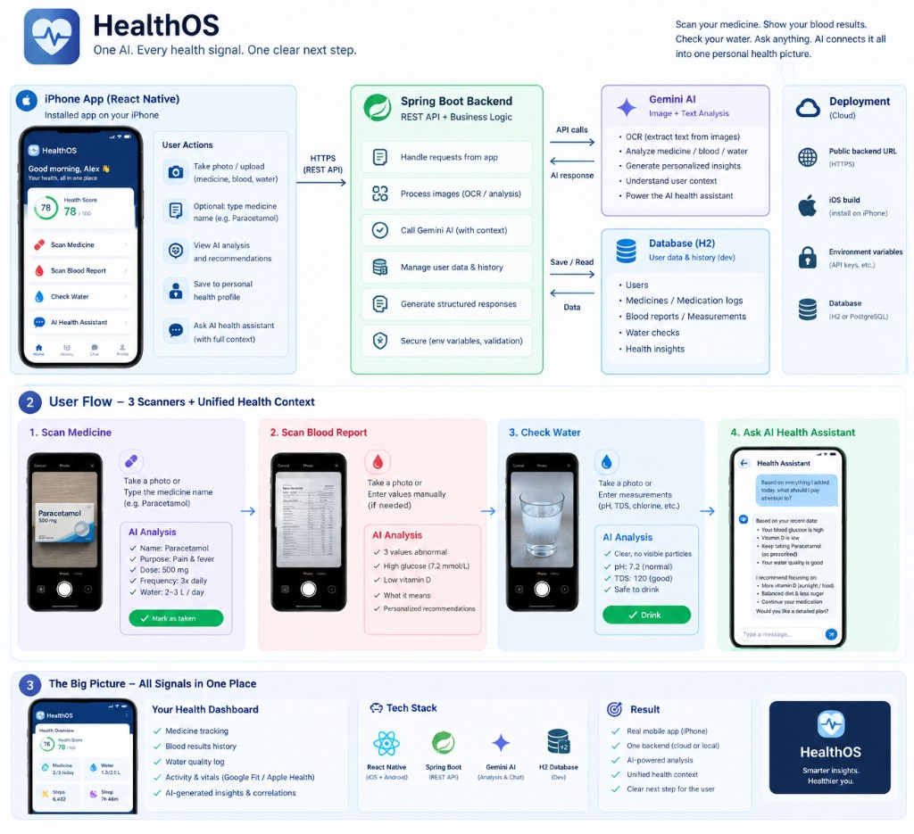

# HealthOS 🩺

> One AI. Every health signal. One clear next step.

HealthOS is a mobile-first app that lets a person scan a medicine, a blood test, or a glass of water, and get one AI-generated answer that ties everything together with their history.

The user takes a photo (or types values manually) and receives clear, structured information, with **Gemini AI** doing the OCR, the analysis, and the plain-language explanation.

HealthOS is designed as an **information and safety-support tool**, not as a replacement for professional medical advice.



---

# 🏗️ Architecture

```text
┌───────────────────────────────┐
│         📱 iPhone / Web       │
│         HealthOS App          │
│                                │
│  Scan Medicine                │
│  Scan Blood Report             │
│  Check Water                  │
│  AI Health Assistant (chat)   │
│  Dashboard                    │
└───────────────┬────────────────┘
                │
                │ HTTPS / REST (JSON)
                ▼
┌────────────────────────────────┐
│       ☕ Spring Boot API       │
│                                │
│  Controllers                  │
│  Validation                   │
│  Services                     │
└───────┬───────────┬───────────┘
        │           │
        ▼           ▼
┌──────────────┐ ┌────────────────┐
│  Feature      │ │  Gemini AI     │
│  Services     │ │  Service       │
│  (Medicine /  │ │  (OCR + text   │
│  Blood /      │ │  analysis,     │
│  Water /      │ │  falls back to │
│  Dashboard)   │ │  local rules   │
└──────┬────────┘ │  if it fails)  │
       │           └────────────────┘
       ▼
┌────────────────────────────────┐
│         H2 Database            │
│      (file-based, JPA)         │
│                                │
│  Users                         │
│  Medicines / Medication logs   │
│  Blood reports / Measurements  │
│  Water checks                  │
│  Chat history                  │
└────────────────────────────────┘
```

### Important architecture principle

**Gemini is the primary analysis engine here — this is different from a "AI only explains, never decides" pattern.** Real Gemini API calls do the OCR *and* the medical-literacy work (identifying a medicine, flagging abnormal blood values, explaining water safety) in one multimodal request. The safety net is not "don't trust the AI" — it's **don't leave the user with a broken screen**: if a Gemini call fails (missing/exhausted key, network, unparseable response), that one feature falls back to simple local rules (a small known-medicine table, reference ranges, pH/TDS/chlorine thresholds) instead of erroring out. Every AI-derived answer — from Gemini or from the fallback — ends with a reminder to consult a professional, and the app never phrases anything as a diagnosis or a treatment instruction.

```text
Photo or manual entry
        ↓
Gemini (OCR + analysis) ── if it fails ──▶ local rule-based fallback
        ↓                                          ↓
        └───────────────────┬──────────────────────┘
                             ↓
              Structured, safety-framed result
                             ↓
                    Saved to per-user history
                             ↓
        AI Health Assistant chat uses last 6 months
        of history (recent entries in full, older
        ones summarized) as context for follow-up
        questions
```

---

# 🛠️ Technology Stack

## Mobile

* React Native
* Expo (lets the real app run on your iPhone via Expo Go without needing a Mac day-to-day; a Mac + Apple Developer account is only needed later, for an actual signed App Store build)
* React Native Web (same codebase, browser fallback — no install needed)

## Backend

* Java
* Spring Boot
* Spring Web
* Spring Data JPA
* Bean Validation
* Lombok

## Database

* H2, file-based (`jdbc:h2:file:./data/healthos`) — not in-memory, so data survives restarts
* Swappable for PostgreSQL later via a config change (JPA means no code rewrite)

## AI

* Google Gemini API (`generateContent`, multimodal — image + prompt in one call), called server-side only so the key never reaches the client

## Infrastructure (later, once we deploy)

* **Render** for the Spring Boot API + Postgres, **Netlify** for the Expo web build — see [Deployment](#-deployment) and [Credits](#credits--student-opportunities). Paid Render avoids the free-tier cold start.

## API Documentation

* OpenAPI / Swagger (planned, once the endpoints below are implemented)

---

# 📂 Project Structure

```text
healthos/
│
├── backend/                      Spring Boot
│   ├── src/main/java/com/healthos/
│   │   ├── HealthosApplication.java
│   │   ├── config/                GeminiConfig
│   │   ├── controller/             Medicine, Blood, Water, Chat, Dashboard
│   │   ├── service/                Medicine, Blood, Water, Chat, Gemini, Dashboard
│   │   ├── repository/             User, Medicine, BloodReport, WaterCheck, ChatMessage
│   │   ├── entity/                 User, Medicine, BloodReport, WaterCheck, ChatMessage
│   │   └── dto/
│   ├── src/main/resources/application.properties
│   ├── data/                       H2 database file lives here
│   ├── pom.xml
│   └── .env.example
│
├── app/                           Expo / React Native (iPhone + web)
│   ├── App.js, app.json, package.json
│   └── src/
│       ├── screens/                Home, ScanMedicine, ScanBlood, CheckWater, Chat, Dashboard
│       ├── navigation/             AppNavigator.js
│       ├── api/                    client.js
│       └── components/
│
├── .gitignore
├── start.sh                      starts backend + app together
├── stop.sh                       stops everything cleanly
└── README.md
```

---

# 🔌 Planned API

The backend will expose REST endpoints per feature.

### Health

```http
GET /api/health
```

### Scan Medicine

```http
POST /api/medicine/scan
```

Multipart request: an image, and/or a `name` field for manual entry. Returns name, purpose, dose, frequency, and a water-intake note.

```http
POST /api/medicine/{id}/taken
GET  /api/medicine
```

### Scan Blood Report

```http
POST /api/blood/scan
```

Multipart request: an image, and/or a `values` JSON string (e.g. `{"glucose": 7.2}`) for manual entry. Returns flagged values and short, non-diagnostic recommendations.

```http
GET /api/blood
```

### Check Water

```http
POST /api/water/check
```

```json
{
  "ph": 7.2,
  "tds": 120,
  "chlorine": 0.5
}
```

Returns a safe/caution verdict with the specific reading that triggered it.

```http
GET /api/water
```

### AI Health Assistant

```http
POST /api/chat
```

```json
{
  "message": "What should I pay attention to today?"
}
```

Pulls the last 6 months of medicine/blood/water history (recent entries in full, older ones summarized), then optionally looks up public-web snippets with **Exa**, then asks Gemini for one plain-language next step. If Exa fails or the key is missing, chat still works on history + Gemini alone. Reply `source` is `GEMINI_EXA` when web results were used.

```http
GET /api/chat/history
```

### Dashboard

```http
GET /api/dashboard
```

Returns the health score and today's medicine/blood/water summary shown on the home screen.

---

# 🤖 AI Integration

Exa (`ExaService`) does OCR-adjacent lookup and the plain-language job via `/answer`. Photos are not read by Exa — name or lab values must be typed; image-only scans use local rules. If Exa fails, the same local fallback as before.

```text
ExaService.answer / generateJson
    │
    ├── success → structured result (source EXA)
    │
    └── failure (bad key / quota / network / bad response)
              → local fallback:
                  • Medicine: known-medicine table
                  • Blood: reference-range rules
                  • Water: pH / TDS / chlorine thresholds
                  • Chat: dashboard reminder
```

The AI must not:

* Diagnose the user
* Invent a dose or a treatment instruction
* Tell the user to stop a prescribed medication
* Claim a medicine or water sample is definitely safe for a specific person
* Replace professional medical advice

---

# 🗄️ Database

H2 (file-based) is the primary database for now, swappable for PostgreSQL later without a schema rewrite (plain JPA entities, no H2-specific features used).

```text
users
medicines
blood_reports
water_checks
chat_messages
```

Every table is scoped by `user_id` from day one (single-user, no login for the MVP, but the schema doesn't need to change when real auth is added later).

---

# 🔐 Environment Variables

Secrets and environment-specific configuration must never be committed to Git.

Create a local `.env` file based on `.env.example` (already confirmed and in place):

```env
GEMINI_API_KEY=
GEMINI_MODEL=gemini-2.5-flash-lite
EXA_API_KEY=
SERVER_PORT=8080
```

`.gitignore` already excludes `.env` and the H2 data files.

---

# 🚀 Local Development

## Prerequisites

* Java 21
* Docker Desktop (only needed once we move to Postgres for deployment — not required for H2 locally)
* Node.js, npm
* Expo tooling
* Git

## One-command start/stop

```bash
./start.sh   # starts the backend AND the Expo app together
./stop.sh    # stops both, including any child processes (e.g. Metro)
```

`start.sh` requires `backend/.env` to already exist (copy it from `backend/.env.example` and fill in `GEMINI_API_KEY` once). Logs go to `logs/backend.log` and `logs/app.log`; `tail -f` either to watch it live. Run `./stop.sh` any time to shut everything down cleanly — it also catches anything left running even if `start.sh` wasn't used to start it.

## Backend only

```bash
cd backend
./mvnw spring-boot:run
```

Runs on `http://localhost:8080`.

## iPhone / Web App only

```bash
cd app
npm install
npx expo start
```

Scan the QR code with **Expo Go** on your iPhone for the native app, or press `w` for the web build in a browser.

Important: on the iPhone, `localhost` refers to the iPhone itself, not your computer. When connecting to a locally running backend, the app needs your computer's local network IP (e.g. `http://YOUR_COMPUTER_IP:8080`), configurable in `app/src/api/client.js` rather than hardcoded. For the deployed version, this becomes the Render backend URL.

---

# 🐳 Deployment

**Current pick: Render (API) + Netlify (web)**, using available student/partner credits. A paid Render instance stays warm — the old objection to Render was only the *free-tier* ~30s cold start.

```text
iPhone (Expo Go)  ──┐
Browser (Netlify) ──┼── HTTPS ──▶  Render  (Spring Boot + Postgres)
                    ┘                     GEMINI_API_KEY and EXA_API_KEY live here only
```

| Option | Role for HealthOS |
|---|---|
| **Render** | Spring Boot API + managed Postgres. `$100` credits cover a small always-on Java service. Set `SPRING_PROFILES_ACTIVE=prod` and the Gemini key as env vars. |
| **Netlify** | Expo web export (`npx expo export --platform web`). HTTPS for the browser app. `3,000` credits. |
| Railway | Still a good host, but we have Render credits and no Railway credits. Keep as a fallback. |
| Fly.io | More control, more manual setup than this stage needs. |
| Self-hosted VPS | Cheapest at scale, but you own OS updates, security, backups, and uptime. |

Switching later is a config change (JDBC URL + `EXPO_PUBLIC_API_URL`), not a rewrite.

---

# Credits / student opportunities

Promo codes stay in the vendor dashboards — **never commit them** (not in this README, not in `.env.example`, not in Git).

| Credit | Amount | Use for HealthOS |
|---|---|---|
| **Render** | $100 | **Deploy now.** Backend + Postgres, always-on so the health app does not sleep. |
| **Netlify** | 3,000 credits | **Deploy now.** Host the Expo web build. |
| **Cursor** | $30 | Keep building features in this repo. |
| **Exa** | $50 | **Wired into `POST /api/chat`.** Public-web lookup before Gemini replies. Set `EXA_API_KEY` on the server (and on Render later). |
| **Firecrawl** | 10,000 credits | Skip for MVP. Scraping drug/label sites has ToS risk; Gemini already reads the photo. |
| **ElevenLabs** | 1 month | Optional later: spoken summaries. Demo, not launch. |
| **Wispr Flow** | 3 months Flow Pro | Personal dictation while coding. Not part of the product. |

Redeem Render and Netlify first. Point Expo Go / Netlify at the Render URL. Never put `GEMINI_API_KEY` or `EXA_API_KEY` on Netlify.

---

# 🧪 Testing

* **Unit tests** for services, the fallback rule logic, validation, and data transformations.
* **Integration tests** for REST endpoints, H2/JPA integration, and the Gemini call (mocked).
* Testcontainers may be introduced later if/when the project moves to Postgres.

---

# 🔒 Security

* API keys live in environment variables only, never in code or client-side.
* Gemini credentials never reach the mobile/web app — all calls happen server-side.
* Validate all incoming requests.
* Configure CORS for the app's origin(s).
* Handle Gemini failures without leaking stack traces to the client.
* Avoid logging secrets.
* Avoid storing more personal health data than the feature needs.
* HTTPS in production (handled by Render and Netlify).

---

# ⚠️ Medical Disclaimer

HealthOS provides general health information and is not a substitute for professional medical advice.

Information provided by the app should not be used to diagnose a condition, change prescribed treatment, or make emergency medical decisions.

Users should consult a qualified doctor or pharmacist for advice specific to their situation.

---

# 📈 Development Strategy

## Phase 1 — Foundation
Repository → Spring Boot → health endpoint → H2 (file-based)

## Phase 2 — Core scans
Medicine scan → Blood scan → Water check, each with photo + manual entry and a working local fallback

## Phase 3 — Gemini integration
Wire real Gemini calls into all three scans, fallback becomes the safety net rather than the primary path

## Phase 4 — AI Health Assistant
Chat endpoint pulling 6 months of history (summarized) as context, plus Exa web lookup before Gemini replies

## Phase 5 — Mobile
Expo/React Native app wired to the backend, iPhone-first with a web build from the same code

## Phase 6 — Deployment
Render (backend + Postgres) + Netlify (Expo web) → HTTPS → app points at the Render URL

## Phase 7 — App Store (later, deferred)
Apple Developer account → signed build → submission

---

## ⚠️ Status

**🚧 Planning complete — moving to implementation next.**

```text
☑ Repository / project structure scaffolded
☑ Architecture and stack decisions confirmed
☑ .env confirmed
☑ start.sh / stop.sh scripts in place
☐ Spring Boot backend (entities, repositories, controllers)
☐ H2 wired up (file-based)
☐ Gemini integration (medicine, blood, water)
☐ Local fallback logic for each feature
☐ AI Health Assistant chat + 6-month context
☐ Dashboard endpoint
☑ Expo starting page (health ping); remaining screens owned by frontend teammate
☐ Expo/React Native feature screens (medicine, blood, water, chat, dashboard)
☑ Render + Netlify config in repo (`render.yaml`, `netlify.toml`); connect GitHub in each dashboard to go live
☐ Apple Developer account / App Store build (deferred)
```

---

## 👨‍💻 HealthOS

**HealthOS — Scan it. Understand it. Know your next step.**